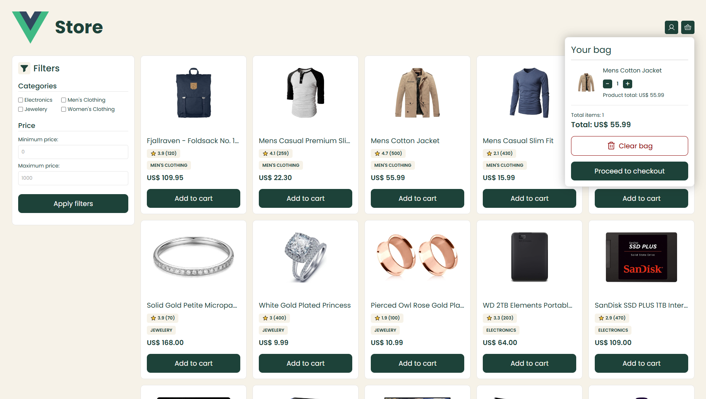

# E-commerce App with Vue.js

This is an E-commerce project created with Vue.js, which simulates the process of buying in a virtual store. The app consumes data from the [FakeStore API](https://fakestoreapi.com/docs) and allows the user to visualize products, add them to the cart, review items, and place an order through a **mocked checkout flow**, for demonstration purposes only.

The project was created for three different viewports: **mobile**, **laptop** and **desktop**. Please note that the _mobile_ and _laptop_ versions are still under development, and will soon be released.

## ⚙️ Technologies used

- [Vue 3](https://vuejs.org/)
- [FakeStore API](https://fakestoreapi.com/docs)
- [Pinia](https://pinia.vuejs.org/) + [Persisted State](https://prazdevs.github.io/pinia-plugin-persistedstate/)
- [Vue Router](https://router.vuejs.org/)
- [Phosphor Icons](https://github.com/phosphor-icons/vue)
- [Vite](https://vite.dev/)

## 🌐 Deployment

This project was deployed using GitHub Pages with a CI/CD approach. The live production version of the application is available [here](https://mjtavrs.github.io/ecommerce-vue/).

## ✨ Views

### 🏠 Home

- List products from the API into cards components.
- Each card has a button to add to the cart.
- Has a filter component that allows the user to filter from category and price range.
<p align="center">
  
</p>

### 🛍️ Cart modal

- Shows all the items inside the cart, quantity of each item, total items in the cart and the total price of the items.
- Allows the user to increase or decrease the items quantity, remove items, clear the cart or go to the cart page and review the items before the checkout.
<p align="center">
  
</p>

### 📦 Product

- Shows information of the selected product, including picture, title, description, rating and price.
- Allows the user to select different quantities of the product and send it to the cart.
<p align="center">
  
</p>

### 🛒 Cart

- List the cart information. Acts as a full page version of the Cart Modal.
<p align="center">
  
</p>

### 💳 Checkout

- Forms to collect personal, shipping and payment information.
- Summary of the order.
<p align="center">
  
</p>

### ✅ Order successful

- Shows a message of placed order with a random number.
<p align="center">
  
</p>

### ❌ 404

- Shows a message that the requested route doesn't exist.
<p align="center">
  
</p>

## 🏃 How to run this project locally

First, you have to clone this repository:

```bash
git clone https://github.com/mjtavrs/ecommerce-vue.git
```

Then, enter the project directory:

```bash
cd ecommerce-vue
```

Install the dependencies:

```bash
npm install
```

Finally, start the development server:

```bash
npm run dev
```

The application will be available at `http://localhost:5173`.

## 📦 Build & Deploy

Begin by building for production:

```bash
npm run build
```

After that, deploy it to GitHub Pages:

```bash
npm run deploy
```

## 🗂️ Project folder structure

```txt
ecommerce-vue/
├── public/
└── src/
    ├── App.vue
    ├── main.js
    ├── assets/
    |   ├── css/
    |   │   └── style.css
    |   └── images/
    ├── components/
    │   ├── BagButton.vue
    │   ├── BagModal.vue
    │   ├── CartFilter.vue
    │   ├── EcommerceHeader.vue
    │   └── ProductCard.vue
    ├── composables/
    │   ├── usePaymentInputFormatter.js
    │   └── useProduct.js
    ├── pages/
    │   ├── CartView.vue
    │   ├── CheckoutView.vue
    │   ├── HomeView.vue
    │   ├── NotFoundView.vue
    │   ├── ProductDetailView.vue
    │   └── OrderSuccessView.vue
    ├── router/
    │   └── index.js
    └── store/
        └── ecommerce.js
```

## 🧠 Future improvements

- 🔄 Code refactoring to improve code reuse and legibility
- 💾 Add to the store a state that will save the last orders
- ✅ Show a list of bought items on the success order page (like Amazon does)
- 🧪 Add E2E tests with [Cypress](https://www.cypress.io/)
- 🔙 Implement a mock back-end service to manage dynamic pricing logic and encapsulate business rules
- 🔐 Simulate user authentication and orders history
- 🌐 Different languages support
- 📱 Improve mobile responsiveness with specific breakpoints

## ✏️ Author

- [@mjtavrs](https://www.github.com/mjtavrs)

## ⚖️ License & Copyright

This repository uses the [MIT](https://choosealicense.com/licenses/mit/) license, which allows commerical use, distribution, modification and private use.
